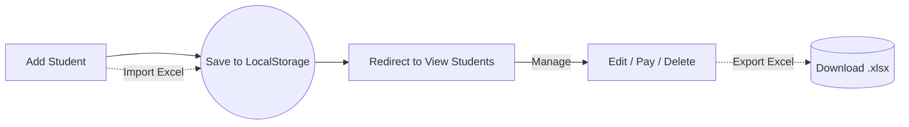
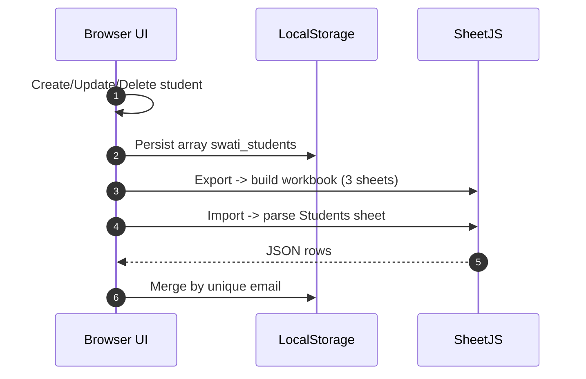
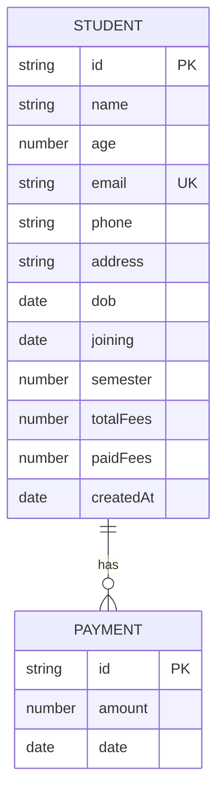

## 📚 SWATI — Student Fee Management (LocalStorage)

<div align="center">
  
  
  <div style="margin-top: 6px;">
    
    
    
  </div>

  <div style="margin-top: 10px;">
    
    
    
    
  </div>
</div>

<p align="center">
  
  <br />
  <small>Single‑page front‑end app • LocalStorage persistence • Excel import/export</small>
</p>

---

## 🚀 Overview

**SWATI** is a production‑ready, client‑side Student Fee Management app. Add students, record payments, analyze monthly status, and export/import data via Excel — all in the browser using LocalStorage and SheetJS. No backend required.

- 🔹 Add students with personal, academic, and fee details
- 🔹 Track payments with history and progress bars
- 🔹 Analyze monthly status: paid, partial, pending, overdue
- 🔹 Export/Import data to/from `.xlsx` for backups and migration

---

## 🛠️ Tech Stack

<div align="center">

| Frontend | Storage | Utilities |
|----------|---------|-----------|
| HTML5, CSS3, JavaScript | Browser LocalStorage | SheetJS (XLSX) |

</div>

---

## 📂 Project Structure

```
📦 SWATI-Fee-Management-App/
├── index.html              # Dashboard: KPIs, recent students, modals
├── add-student.html        # Form to add a new student
├── view-students.html      # List, search, filter, details, edit
├── student-details.html    # Shell page; details rendered via modal/UI
├── script.js               # App logic, LocalStorage CRUD, Excel import/export
├── style.css               # Modern responsive UI styles
└── images/
    └── logo.png            # Brand logo used in header/sidebar
```

---

## 🔗 Pages & Flow

- **Dashboard (`index.html`)**
  - Shows total students, paid/pending counts, total revenue
  - Recent students list with status chips
  - Excel controls: Export to Excel, Import from Excel
  - Student Details modal + Edit modal (invoked from lists)

- **Add Student (`add-student.html`)**
  - Validated form; prevents duplicate email
  - Saves to LocalStorage then redirects to `view-students.html`

- **View Students (`view-students.html`)**
  - Search by name/email/phone, filter by status (Paid/Pending)
  - View details, pay fees, edit, or delete



---

## 🧠 How It Works

1. Data is persisted in `localStorage` under the key `swati_students`.
2. Each student stores personal info, academic info, total/paid fees, and `feeHistory`.
3. Monthly fee breakdown is computed from `joining` date, `semester` duration, and payments, labeling months as `paid`, `partial`, `pending`, or `overdue`.
4. Export/Import uses SheetJS:
   - Export generates a workbook with sheets: `Students`, `PaymentHistory`, and `Summary`.
   - Import reads `Students` and merges unique entries by email.



---

## 🧩 Data Model (LocalStorage)

```json
{
  "id": "1705409823456",
  "name": "Alice Johnson",
  "age": 21,
  "email": "alice@example.com",
  "phone": "9876543210",
  "address": "New Delhi, IN",
  "dob": "2004-05-10",
  "joining": "2025-01-01",
  "semester": 6,
  "totalFees": 60000,
  "paidFees": 10000,
  "feeHistory": [
    { "id": "1705410123456", "amount": 10000, "date": "2025-02-01T10:20:30.000Z" }
  ],
  "createdAt": "2025-01-01T08:00:00.000Z"
}
```

### ER Perspective (Student ↔ Payment)

- Conceptually, `feeHistory` is an embedded array of `Payment` records inside each `Student`.



Collection key: `localStorage['swati_students'] = Student[]`.

---

## ✅ Features

- **Dashboard KPIs**: Total Students, Fees Paid, Fees Pending, Total Revenue
- **Recent Students** with quick status preview
- **Student Details modal** with personal, academic, and fee summary
- **Payment History** with add and delete actions
- **Monthly Breakdown** with paid/partial/pending/overdue tags and progress
- **Search & Filter** in the students list
- **Edit/Delete** student records
- **Excel Export/Import/Backup** via SheetJS

---

## ⚙️ Installation & Local Setup

No build step needed.

```bash
# Option A: Open directly
Open index.html in your browser

# Option B: Serve locally (recommended for navigation)
# Using Node (http-server)
px http-server . -p 8080 --cors
# then open http://localhost:8080

# Or using Python
python -m http.server 8080
# then open http://localhost:8080
```

### Usage Workflow

1) Open `add-student.html` and add a student.
2) You’ll be redirected to `view-students.html` to manage records.
3) Use the Dashboard (`index.html`) for stats and Excel export/import.

Data lives entirely in your browser. Use Export regularly to create backups.

---

## 📤 Excel Export/Import

- Export creates `swati_students_data.xlsx` with:
  - `Students`: flattened students data
  - `PaymentHistory`: one row per payment
  - `Summary`: totals and aggregates
- Import merges by unique email. Unknown columns are ignored.

Tip: Browsers cannot overwrite existing files directly; each export downloads a new file.

---

## 🔒 Notes & Limitations

- LocalStorage is browser‑scoped; clearing site data removes records. Keep backups.
- No server‑side validation or authentication. For production multi‑user use, pair with a backend and database.
- Overpayments are prevented; partial months are tracked with carry‑forward.

---

## 🛣️ Roadmap

- Cloud backend (API + DB) and auth roles
- Pagination and advanced filters in list view
- Printable receipts and shareable payment links
- Cloud export (Google Drive/OneDrive) and scheduled backups

---

## 👨‍💻 Developer

<div align="center">
  
  
  <p><em>Computer Science Student & Aspiring Software Developer</em></p>
  
  <div style="margin: 16px 0;">
    <a href="https://shadowx-frontend.onrender.com" target="_blank">
      
    </a>
    <a href="mailto:officialluckylongre@gmail.com">
      
    </a>
    <a href="https://www.linkedin.com/in/lucky-longre/" target="_blank">
      
    </a>
  </div>
  
  <p>
    
    
    
  </p>
</div>

---

## 📄 License

MIT


